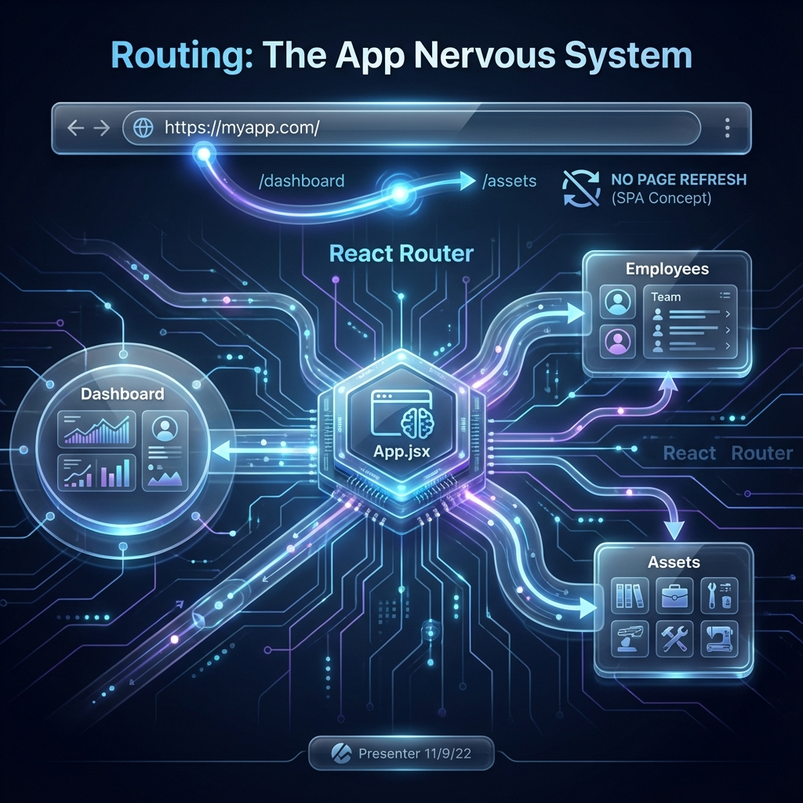
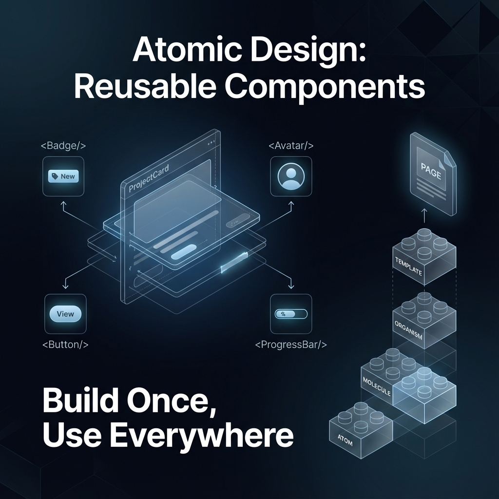
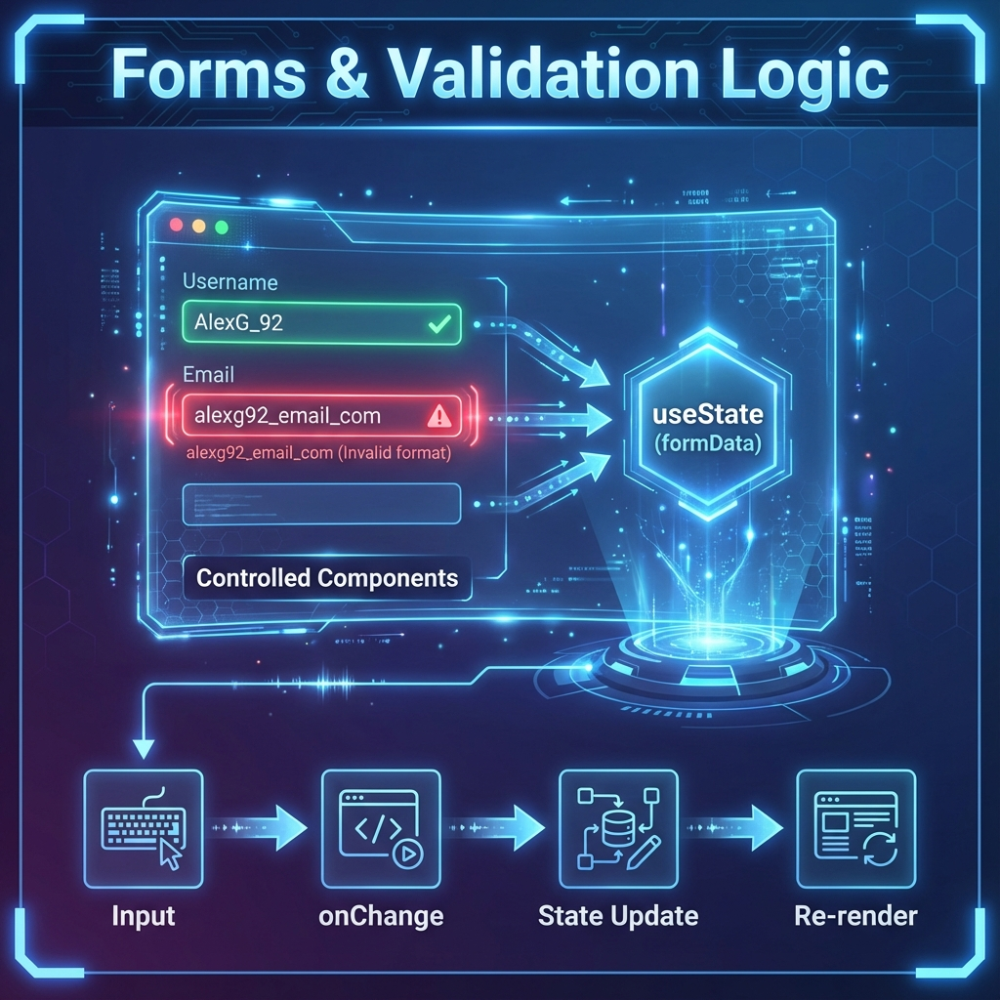

# 🎓 Masterclass: Building a Modern React OS
**Project:** Employee Management Portal  
**Framework:** React 18 + Vite + Bootstrap 5  
**Styling:** Glassmorphism + Lucide Icons  

---

## 📚 Course Overview
This document will teach you how to build the scalable, professional-grade Employee Management Portal you see in front of you. We will break it down module by module, explaining the *engineering decisions*, *React hooks*, and *design patterns* used.

**By the end of this course, you will be able to build this entire system from scratch.**

---

## 🚀 Module 1: The Foundation & Architecture

### 1.1 The High-Level Vision
Before writing a single line of code, we must understand *what* we are building. We are not building a website; we are building a **System**.


A "System" differs from a website because it manages state, data consistency, and user workflows.

### 1.2 The Technology Stack
We chose our tools carefully to balance **speed of development** with **high performance**.


*   **Vite:** The build tool. Unlike `create-react-app`, Vite dev servers start instantly because it uses native browser ES modules.
*   **React:** The library for building user interfaces. We use functional components and hooks exclusively.
*   **Reactstrap:** A library that gives us Bootstrap 5 components (like Modals, Grids) as React components. It saves us from writing basic HTML structures.
*   **Lucide-React:** Provides clean, consistent SVG icons (`<User />`, `<Activity />`, `<Briefcase />`).
*   **Chart.js:** For our analytics. We wrapper it with `react-chartjs-2`.

---

## 🧠 Module 2: The Global Brain (State Management)

### 2.1 The Problem: Prop Drilling
In a complex app, data needs to live everywhere.
*   The **Dashboard** needs the *total employee count*.
*   The **Projects Page** needs to assign *employees* to projects.
*   The **Subscriptions Page** needs to know which *employee* is using a software tool.

If we kept our data in `Dashboard.jsx`, no other page could see it. If we kept it in `App.jsx`, we would have to pass it down like `App -> Layout -> Page -> Component -> Button`. This is called **Prop Drilling**, and it is messy.

### 2.2 The Solution: Context API


We created `GlobalContext.jsx`. Think of this as the **Brain** of your application.

**Key Code Breakdown (`GlobalContext.jsx`):**

```javascript
// 1. Create the Context
export const GlobalContext = createContext();

// 2. The Provider Component
export const GlobalProvider = ({ children }) => {
    // 3. The "Database" (State)
    const [employees, setEmployees] = useState(initialEmployees);
    const [projects, setProjects] = useState(initialProjects);

    // 4. The Logic (Actions)
    const addEmployee = (employee) => {
        setEmployees([...employees, { ...employee, id: Date.now() }]);
    };

    // 5. Expose everything to the app
    return (
        <GlobalContext.Provider value={{ employees, projects, addEmployee }}>
            {children}
        </GlobalContext.Provider>
    );
};
```

**Why this is professional:**
*   **Decoupling:** `Dashboard.jsx` doesn't need to know *how* to add an employee. It just calls `addEmployee()`.
*   **Persistence:** We use `useEffect` to save this state to `localStorage` automatically.

---

## 🗺️ Module 3: Routing & Navigation

### 3.1 The "Single Page" Illusion
A traditional website reloads the page when you click a link. A React App (SPA) never reloads. It just swaps the main component.



**Key Code Breakdown (`App.jsx`):**

```javascript
<Router>
    <Routes>
        <Route path="/" element={<Layout />}>
            <Route index element={<Dashboard />} />
            <Route path="employees" element={<EmployeeList />} />
            <Route path="projects" element={<Projects />} />
        </Route>
    </Routes>
</Router>
```

*   **`<Layout />`**: This is the "Frame". It contains the Sidebar and Navbar. It *never* unmounts.
*   **`<Outlet />`**: Inside `Layout.jsx`, there is a component called `<Outlet />`. This is a magic placeholder where `Dashboard`, `EmployeeList`, or `Projects` will appear depending on the URL.

---

## 🧱 Module 4: Atomic Component Design

### 4.1 "Build Once, Use Everywhere"
Professional developers don't write the same code twice. We use **Atomic Design**.



**Example: The Status Badge**
Instead of writing `<span className="badge bg-success">Active</span>` 50 times, we write it logic-agnostically once, or rely on a helper function.

```javascript
// Helper in Projects.jsx
const getStatusBadge = (status) => {
    const colors = {
        'Active': 'success',
        'On Hold': 'warning',
        'Completed': 'info'
    };
    return <Badge color={colors[status]}>{status}</Badge>;
}
```

Now, if we want to change "Active" to be *blue* instead of *green*, we change it in **one place**, and the entire app updates.

---

## ⚡ Module 5: Performance Optimization

### 5.1 The Cost of Calculation
Your dashboard calculates:
*   Total Employees
*   Growth Trends (Month over Month)
*   Project Completion Rates

Doing this math *every single time* the component renders (e.g., when you hover a button) would freeze the browser.

### 5.2 The Solution: `useMemo`


`useMemo` is a hook that says: *"Only do this expensive math if the data has actually changed."*

**Code Logic (`Dashboard.jsx`):**

```javascript
const stats = useMemo(() => {
    // 1. Expensive Math
    const total = employees.length;
    const active = employees.filter(e => e.status === 'Active').length;
    const growth = calculateGrowth(employees); 

    return { total, active, growth };
}, [employees]); // <--- Dependency Array
```

If `employees` hasn't changed, React gives us the cached answer instantly (0ms).

---

## 📝 Module 6: Forms & Validation

### 6.1 Controlled Components
In React, we don't let the DOM handle the form data (like standard HTML). We force the data to live in the React State. This is called a **Controlled Component**.



**The Pattern:**

```javascript
const [formData, setFormData] = useState({ name: '', email: '' });

// The Input
<Input 
    value={formData.name} // 1. Value comes from State
    onChange={(e) => setFormData({...formData, name: e.target.value})} // 2. Change updates State
/>
```

### 6.2 Validation Logic
We validate *before* submission.

```javascript
const validate = () => {
    const newErrors = {};
    if (!formData.name) newErrors.name = "Name is required";
    if (formData.salary < 25000) newErrors.salary = "Salary too low";
    
    setErrors(newErrors);
    return Object.keys(newErrors).length === 0; // Return true if no errors
}
```

This ensures "Garbage In, Garbage Out" never happens in our database.

---

## 🎨 Course Conclusion: You Are Now an Architect
You have learned that building an app is not just about writing syntax. It is about:
1.  **Architecture:** Using `GlobalContext` to manage state efficiently.
2.  **Navigation:** Using `React-Router` for seamless transitions.
3.  **Performance:** Using `useMemo` to keep the UI buttery smooth.
4.  **UX:** Using `Glassmorphism` and `Validation` to delight the user.

**Everything you need is in this folder.**
Explore the code, reference these slides, and build something amazing.
